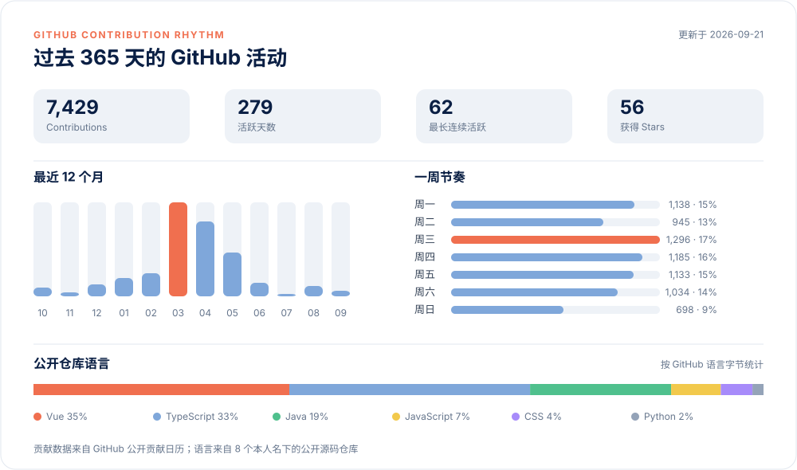

  

  

  
  
  
  

---

## 关于我

坐标 **深圳**，2022 年开始写代码。Go / Python 做后端，Vue 写前端。

熟悉海外独立站开发、SEO、海外支付，以及 SaaS 产品从全栈开发到部署的完整流程。

目前主要使用 Codex 进行编程开发，也喜欢开发一些自己的开源工具。

如果你在寻找技术合作者、远程开发者，或者想聊聊想法、做点技术咨询，随时联系我。

---

## 技术栈

### AI 编程

  
  
  
  

### 语言与前端

  
  
  
  
  

### 后端、数据与交付

  
  
  
  
  
  
  
  

---

## GitHub 数据

  

  

---

## 开源项目

### [Figma Context MCP](https://github.com/1yhy/Figma-Context-MCP)

让 AI 编程工具直接读取 Figma 设计上下文，提供布局识别、CSS 生成、资源导出和低 Token 数据访问。

  
  
  
  

  <code>TypeScript</code> · <code>Model Context Protocol</code> · <code>Figma API</code> · <code>Design to Code</code>

---

## 最近文章

公开发布于 [远栈 StackOnward](https://stackonward.com/) 的最新内容。

<!-- BLOG-POST-LIST:START -->
- [2026 支付宝购买美区 App Store 礼品卡：最新入口、兑换与避坑全流程](https://stackonward.com/posts/alipay-app-store-gift-card/) · 2026-08-08
- [美区 Apple ID 注册教程：免信用卡、支持中国手机号](https://stackonward.com/posts/register-us-apple-id/) · 2026-08-08
- [Figma MCP服务器：AI驱动设计到代码自动化转换 | 提升设计开发协作效率](https://stackonward.com/posts/figma-mcp/) · 2025-03-30
- [n8n自动化工作流搭建指南 | 从Docker部署到RSS钉钉推送实战](https://stackonward.com/posts/n8n/) · 2025-02-05
- [VSCode智能编程指南 | Roo Code配置与Deepseek模型使用](https://stackonward.com/posts/roo-code-and-deepseek/) · 2025-02-04
<!-- BLOG-POST-LIST:END -->

---

  

